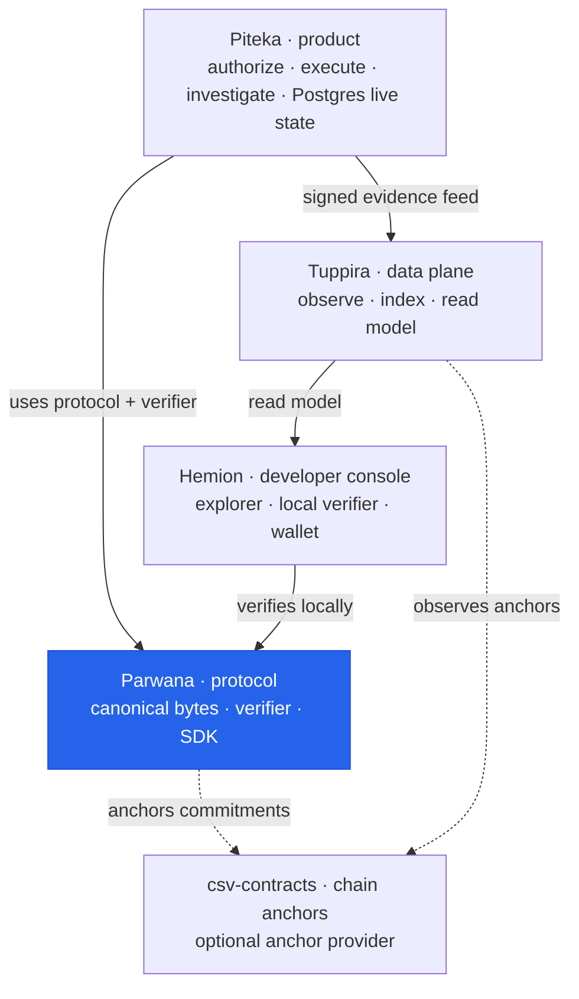

# AGENTS.md — Parwana Operational Guide

## Topology

Where Parwana sits in the DieWan Accountability Platform (this guide maps
Parwana's crates; the diagram localizes the repo in the org):



**You are here — Parwana**, the neutral protocol. Org charter:
[`../development/ARCHITECTURE.md`](../development/ARCHITECTURE.md).

## Glossary

Core protocol concepts behind the crate map below:

| Term | Kind | Plain-English meaning | Real-world example |
|------|------|-----------------------|--------------------|
| Sanad | Data structure | Parwana's proof-carrying asset instrument; `SanadId` identifies one. | A property deed that carries its own proof. |
| Seal (Single-Use Seal) | Data structure | A consumable condition closed exactly once. | A tamper-evident package seal. |
| Proof Bundle | Data structure | The verifiable evidence of a transfer (`csv-proof`), checked by `csv-verifier`. | A sealed dossier anyone can validate. |
| Transfer | Data structure | A deterministic ownership transition driven by the typestate algebra (`csv-algebra`). | Endorsing a cheque to a new payee. |
| Replay resistance | Keyword | The guarantee a transition can't be re-applied (replay DB, replay IDs). | A one-time password unusable twice. |
| Canonical serialization | Keyword | Deterministic CBOR (`csv-codec`) on all hashing paths — never `serde_json`. | One official byte-for-byte file format. |
| Verifier | Component | Canonical proof verification (`csv-verifier`). | A referee applying a fixed rulebook. |
| Anchor | Keyword | Publishing a commitment on-chain. | A notary stamp proving existence. |

## Repo structure

Rust monorepo (virtual Cargo workspace, edition 2024, rust-version 1.95). The primary protocol crate is `csv-protocol`.

**Workspace members (32 crates):**

**Phase 1 restructuring crates (new architecture):**

- `csv-algebra` — pure no_std typestate algebra for transfer state machine
- `csv-wire` — wire encoding and transport layer (owns all serde/transport encoding)
- `csv-protocol` — protocol orchestration layer
- `csv-codec` — canonical serialization (CBOR)
- `csv-hash` — hash types, SanadId, replay ID types
- `csv-proof` — proof bundle types, replay ID derivation
- `csv-verifier` — canonical proof verification
- `csv-schema` — schema definitions
- `csv-content` — content types (Merkle trees, selective disclosure, encryption)
- `csv-storage` — storage traits and backends (redb, PostgreSQL, in-memory)
- `csv-testkit` — test fixtures and adversarial testing
- `csv-contract-bindings` — smart contract bindings
- `csv-coordinator` — per-chain execution cells with isolated failure domains
- `csv-admission` — admission control and pressure boundaries
- `csv-architecture` — architecture guardrails and dependency validation

**Runtime & orchestration crates:**

- `csv-runtime` — `TransferCoordinator`, lease management, replay DB, circuit breakers, execution journal, and health monitoring; it consumes chain-agnostic protocol, verification, storage, wire, and orchestration crates
- `csv-sdk` — public SDK facade
- `csv-observability` — metrics, logging, runtime health monitoring

**CLI & tooling crates:**

- `csv-cli` — CLI binary (runtime monitoring, trust management, content operations, chain/wallet/sanad/proof/cross-chain/seal commands)
- `csv-keys` — key management
- `csv-wallet` — wallet derivation and wallet-facing operations
- `csv-store` — legacy state storage

**Legacy crates (being refactored/deprecated):**

- `csv-core` — **REMOVED** — legacy protocol types migrated to csv-protocol/csv-algebra/csv-wire. See `csv-core-TOMBSTONE.md` for migration path.
- `csv-p2p` — peer-to-peer networking

**Chain adapters** (under `csv-adapters/`, each implements `SealProtocol` + `ChainBackend` traits):
`csv-adapters/csv-bitcoin`, `csv-adapters/csv-ethereum`, `csv-adapters/csv-solana`, `csv-adapters/csv-sui`, `csv-adapters/csv-aptos`, `csv-adapters/csv-celestia`

**Adapter support crates:** `csv-adapters/csv-adapter-core` (shared adapter traits/types) and `csv-adapter-factory` (feature-gated concrete-adapter assembly).

**Other crates:** `csv-examples/` is a non-publishable workspace member; `csv-mcp-server/` is not in the workspace.

**Smart contracts:** `csv-contracts/ethereum/` (Foundry), `csv-contracts/solana/` (Anchor), `csv-contracts/sui/` (Sui Move), `csv-contracts/aptos/` (Aptos Move).

**Chain configs:** `chains/*.toml` — per-chain TOML configs (Solana, Ethereum, Sui, Bitcoin, Aptos).

**Documentation:** `csv-docs/` — all protocol documentation (no `docs/` directory at root).
**CLI Tutorial:** `csv-cli-tutorial.md` — comprehensive CLI command reference with testnet examples.
**Examples:** `csv-examples/` — organized examples (getting-started/, advanced/, cli-tutorial/).

**Note:** `tuppira/*` and `typescript-sdk/` do not exist in the current codebase. `csv-wallet/` does exist and is a workspace member.

## Commands

```bash
# Build everything
cargo build --workspace --all-features

# Run all tests
cargo test --workspace --all-features

# Run doc tests
cargo test --workspace --doc

# Lint + format check
cargo fmt --all -- --check
cargo clippy --workspace --all-features -- -D warnings

# WASM32 build check (csv-runtime only)
cargo build --package csv-runtime --no-default-features --target wasm32-unknown-unknown

# Fuzz targets (cd fuzz first)
cargo install cargo-fuzz
cd fuzz && cargo fuzz run proof_bundle_decode -- -max_total_time=60

# Golden corpus and protocol constitution tests
cargo test -p csv-protocol --test golden_vectors
cargo test -p csv-protocol --test protocol_constitution

# Release metadata and package-content checks
scripts/check-release.sh

# Security audit
cargo install cargo-audit && cargo audit

# CLI build
cargo build -p csv-cli --release

# Contracts
cd csv-contracts/ethereum/contracts && forge build
cd csv-contracts/solana/contracts && NO_DNA=1 anchor build
cd csv-contracts/sui/contracts && sui move build
cd csv-contracts/aptos/contracts && aptos move compile
```

## Architecture rules (enforced by CI)

- `csv-algebra` MUST NOT depend on `csv-wire` (enforced by deny.toml)
- `csv-cli` must NOT import chain adapters directly — use `csv-runtime`
- `csv-runtime` may depend on chain-agnostic protocol, adapter-interface, verification, storage, wire/codec, coordinator, admission, and observability crates; it must not depend on concrete chain adapters
- `csv-runtime` uses `csv-coordinator` for per-chain execution cells
- `csv-runtime` uses `csv-admission` for admission control and pressure boundaries
- `csv-coordinator` may enable concrete chain adapters behind chain feature flags; adapters must never depend back on coordinator/runtime
- `csv-sdk` and `csv-adapter-factory` are assembly boundaries and may expose feature-gated concrete adapters, but transfer mutation still delegates to `csv-runtime`
- `csv-verifier` is chain-agnostic and depends on protocol/proof/hash/codec crates (no csv-core or concrete-adapter dependency)
- `csv-storage` depends on protocol/hash/proof crates (no csv-core dependency)
- `serde_json` is forbidden in canonical hashing paths; use `canonical_cbor`
- `persistent` (redb) compiles on wasm32 but is non-functional there (no real filesystem); wasm builds use the in-memory stores, and chain adapters + full tokio are target-gated to native
- `experimental` feature gates: `vm`, `rgb`, `commit_mux`
- Finality is NEVER optional — all runtime modes enforce strict finality
- CLI holds NO protocol authority state (leases, transfers) — all delegated to csv-runtime
- Execution journal (`execution_journal.rs`) provides crash-safe phase tracking
- `csv-coordinator` provides isolated failure domains per chain (bounded queues, circuit breakers, memory ceilings)
- `csv-admission` provides pressure boundary (rejects excess work before state mutation)
- `csv-content` is chain-agnostic (no adapter dependencies)
- `csv-observability` is chain-agnostic (no adapter dependencies)

## Testing notes

- Integration tests are `#[ignored]` and require RPC secrets (signet, sepolia, sui testnet)
- nextest config: 30s slow-timeout for crypto tests (`.config/nextest.toml`)
- Execution journal tests validate crash recovery paths
- Architecture compliance tests enforce no csv-core imports in csv-cli

## CLI Commands Reference

### Chain Management

```bash
csv chain list                          # List all supported chains
csv chain status --chain ethereum       # Check chain status
csv chain set-rpc --chain ethereum <URL> # Set custom RPC URL
csv chain set-contract --chain ethereum <ADDR> # Set contract address
csv chain set-network --chain ethereum --network main # Change network
```

### Wallet Operations

```bash
csv wallet init --network test --words 12   # Initialize wallet
csv wallet export --out wallet.csvw         # Export the common encrypted wallet file
csv wallet import wallet.csvw --mode replace  # Import a wallet file (replace | profile)
csv wallet import-mnemonic                  # Import a mnemonic at a hidden prompt
csv wallet generate --chain bitcoin         # Generate for specific chain
csv wallet balance --chain ethereum         # Check balance
csv wallet list                             # List all addresses
csv wallet private-key --chain ethereum     # View private key (caution)
```

### Sanad Operations

```bash
csv sanad create --chain bitcoin --value 100000    # Create Sanad
csv sanad show <sanad_id>                          # Show Sanad details
csv sanad list [--chain <chain>]                   # List Sanads
csv sanad transfer <sanad_id> <to_address>         # Transfer Sanad
csv sanad consume <sanad_id>                       # Consume Sanad
```

### Proof Operations

```bash
csv proof generate --chain ethereum <sanad_id> -o proof.json    # Generate proof
csv proof verify --chain sui --proof-file proof.json            # Verify proof
csv proof verify-cross-chain --source ethereum --dest sui proof.json  # Cross-chain verify
```

### Cross-Chain Transfers

A transfer mode is chosen explicitly by verb (never a `--mode` flag). The old
`transfer` verb is a deprecation shim that errors and points at the two modes.

```bash
# On-chain mode: materialize the sanad via the thin-registry mint.
#   --proof attestor (default): RFC §9 verifier-signed attestation (available now)
#   --proof zk: RFC §9.5 ZkSeal path (returns a not-available error until the prover lands)
csv cross-chain materialize --from bitcoin --to sui --sanad-id <id> --dest-owner <addr> [--proof attestor|zk] [--wait]

# Interactive off-chain mode (no destination tx/gas): send against a recipient invoice.
csv cross-chain send --from bitcoin --sanad-id <id> --invoice <blob>
csv cross-chain invoice --schema <sanad-type> --seal <dest-seal-ref>   # recipient issues invoice
csv cross-chain accept <consignment-file>                              # recipient validates + accepts

csv cross-chain resume <transfer_id> [--wait]   # advance a materialize awaiting finality
csv cross-chain status <transfer_id>
csv cross-chain list [--from <chain>] [--to <chain>]
csv cross-chain retry <transfer_id>
```

### Seal Operations

```bash
csv seal create --chain ethereum --value 1000000000000000000
csv seal consume --chain ethereum <seal_ref>
csv seal verify --chain ethereum <seal_ref>
csv seal list [--chain <chain>]
```

### Content Management

```bash
csv content create --input leaves.txt --output tree.json    # Create content tree
csv content prove --tree tree.json --index 0                # Generate Merkle proof
csv content verify --tree tree.json [--leaf <data>] [--leaf-index <n>]
csv content encrypt --tree tree.json --key-id <id>          # Encrypt subtree
csv content disclose --tree tree.json --include 0,2         # Selective disclosure
csv content attach add --tree tree.json --file <path> -m <type>
csv content participants add --tree tree.json --key <hex> -r <role>
csv content claims create --tree tree.json -p <predicate> -d <description>
```

### Trust Management

```bash
csv trust status                              # Check trust package status
csv trust export -o trust-package.json        # Export trust package
csv trust import trust-package.json           # Import trust package
csv trust verify trust-package.json           # Verify trust package
csv trust rotate <height> <hash>              # Rotate checkpoint
```

### Runtime Monitoring

```bash
csv runtime status        # Health status and mode
csv runtime health        # Per-component health checks
csv runtime admission     # Admission control pressure
csv runtime events --count 20  # Recent runtime events
```

### Validation & Inspection

```bash
csv validate consignment <file>
csv validate proof <proof> --chain <chain>
csv validate seal <seal_ref>
csv validate offline --file <proof>
csv inspect replay --id <hex>
csv inspect merkle --root <hex>
```

### Schema Tooling

```bash
csv schema validate --file <schema.json>
csv schema compile --file <schema.json> --out <output>
csv schema diff --left <v1.json> --right <v2.json>
```

### End-to-End Testing

```bash
csv test run --chain-pair bitcoin:sui   # Run specific chain pair
csv test run-all                        # Run all 9 chain pairs
csv test scenario <name>                # Run specific scenario
csv test results                        # View test results
```

## Contracts

- Ethereum: Foundry (`forge build` in `csv-contracts/ethereum/contracts`)
- Solana: Anchor (`NO_DNA=1 anchor build` in `csv-contracts/solana/contracts`)
- Sui: Sui Move (`sui move build` in `csv-contracts/sui/contracts`)
- Aptos: Aptos CLI (`aptos move compile` in `csv-contracts/aptos/contracts`)

## Security

See `.agents/AGENT.md` for protocol invariants, forbidden patterns, and verification rules.
See `csv-docs/THREAT_MODEL.md` for the threat model.
See `csv-docs/PROTOCOL_INVARIANTS.md` and `csv-docs/PROTOCOL_CONSTITUTION.md` for protocol rules.

## Architecture Overview

```
csv-sdk (public facade)
  ├── csv-runtime (transfer authority + execution journal + health monitoring)
  └── csv-adapter-factory / feature-gated adapters (assembly only)

csv-runtime
        ├── csv-admission (pressure boundary)
        ├── csv-coordinator (per-chain execution cells)
        ├── csv-observability (metrics, logging, health)
        ├── csv-protocol / csv-proof / csv-verifier
        ├── csv-hash / csv-codec / csv-wire
        ├── csv-storage
        └── csv-adapter-core (interfaces only)

csv-coordinator / csv-adapter-factory
  └── feature-gated concrete adapters
        ├── csv-bitcoin
        ├── csv-ethereum
        ├── csv-solana
        ├── csv-sui
        └── csv-aptos
```

## Key Architectural Principles

1. **Typestate enforcement**: `csv-algebra` provides compile-time state transition guarantees
2. **Serialization boundary**: `csv-wire` owns ALL serde and transport encoding
3. **Deterministic encoding**: `csv-codec` provides canonical CBOR for protocol state
4. **Isolated execution**: `csv-coordinator` provides per-chain isolated failure domains
5. **Admission control**: `csv-admission` prevents overload by rejecting excess work
6. **Protocol purity**: `csv-protocol` defines what is correct, not how to implement it
7. **Verification canonicalization**: `csv-verifier` provides single source of truth for verification
8. **Storage abstraction**: `csv-storage` provides unified interface for multiple backends
9. **Content integrity**: `csv-content` provides Merkleized content trees with selective disclosure
10. **Observability**: `csv-observability` provides runtime health, metrics, and structured logging
