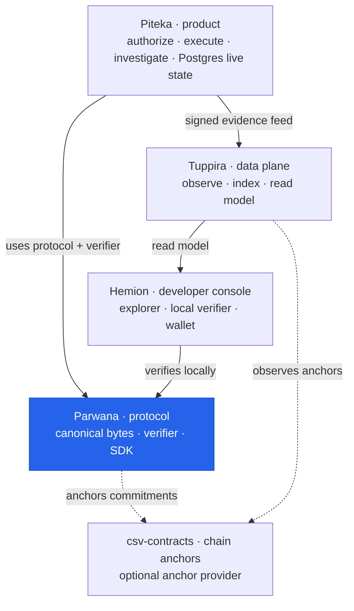

# Parwana

## Constitutional Cross-Chain Verification Infrastructure

> A protocol-grade, adversarially-aware, multi-chain verification and transfer system designed around deterministic state evolution, replay resistance, canonical proof semantics, and mechanically enforced invariants.

## Topology

Where Parwana sits in the DieWan Accountability Platform (this document details
Parwana's *internal* architecture; the diagram localizes it in the org):



**You are here — Parwana**, the neutral protocol every product depends on. See
the org charter in [`../development/ARCHITECTURE.md`](../development/ARCHITECTURE.md).

## Glossary

Core protocol concepts used throughout this document:

| Term | Kind | Plain-English meaning | Real-world example |
|------|------|-----------------------|--------------------|
| Proof | Data structure | Self-contained cryptographic evidence that a state transition is valid, carried with the asset. | A signed certificate you can check without phoning the issuer. |
| Transfer | Data structure | A deterministic state transition that moves ownership by consuming a seal and creating new ones. | Endorsing a cheque over to a new payee. |
| Replay resistance | Keyword | The guarantee that a past transition can't be re-applied to double-spend. | A one-time password that stops working after a single use. |
| Finality | Keyword | The point at which a transition is settled and can't be reorged away. | A bank transfer clearing irreversibly. |
| Commitment | Keyword | The canonical byte/hash summary of state that a chain anchors. | A tamper-proof fingerprint of a document. |
| Anchor | Keyword | Publishing a commitment on a chain as timestamp/settlement evidence. | A notary stamp proving existence at a point in time. |
| Canonical serialization | Keyword | The single deterministic byte encoding (CBOR) used everywhere hashing happens — never `serde_json`. | One official file format everyone must produce byte-for-byte. |
| Verifier | Component | The side-effect-free logic that checks a proof against the rules to reach a deterministic verdict. | A referee applying a fixed rulebook to reach the same call every time. |

---

# 1. What This Repository Is

Parwana is not a blockchain application.

It is a **cross-chain computational protocol environment** that coordinates:

- proof generation,
- transfer verification,
- replay prevention,
- finality enforcement,
- canonical serialization,
- state transition governance,
- recovery orchestration,
- cryptographic anchoring,
- multi-chain execution,
- adversarial runtime containment.

The system is designed as a **constitutional protocol runtime** rather than a collection of blockchain SDK wrappers.

The architecture prioritizes:

- invariant preservation over convenience,
- deterministic behavior over implicit behavior,
- explicit state evolution over mutable workflows,
- cryptographic accountability over trust assumptions,
- anti-fragility over optimistic execution.

---

# 2. Core Philosophy

Parwana assumes:

- chains can reorg,
- RPC endpoints can lie,
- proofs can be malformed,
- relayers can equivocate,
- queues can overload,
- runtimes can crash,
- recovery can replay,
- operators can misconfigure systems.

Therefore:

> correctness must emerge from enforced architecture, not developer discipline.

The repository is built around the idea that protocol safety should become progressively more mechanical.

---

# 3. What The Protocol Does

Parwana coordinates secure cross-chain verification and transfer workflows across heterogeneous chains including:

- Ethereum
- Bitcoin
- Solana
- Aptos
- Sui
- Celestia

The protocol supports:

- cryptographic sealing,
- canonical proof bundles,
- replay-safe transfer orchestration,
- proof provenance tracking,
- deterministic recovery,
- chain-specific finality modeling,
- cross-chain mint verification,
- canonical content commitments,
- zk-proof integration,
- adversarial testing infrastructure.

The system can act as:

- a transfer runtime,
- a verification substrate,
- a proof coordination layer,
- a cryptographic anchoring framework,
- a protocol execution environment.

---

# 4. High-Level Architecture

```text
┌────────────────────────────────────────────────────────────┐
│                    APPLICATION LAYER                      │
│                CLI / SDK / MCP / Services                 │
└────────────────────────────────────────────────────────────┘
                             │
                             ▼
┌────────────────────────────────────────────────────────────┐
│                     CSV RUNTIME                           │
│------------------------------------------------------------│
│ TransferCoordinator                                        │
│ Replay Database                                            │
│ Event Bus                                                  │
│ Backpressure Control                                       │
│ Failure Domains                                            │
│ Recovery Engine                                            │
│ Lease Coordination                                         │
│ Runtime Policies                                           │
└────────────────────────────────────────────────────────────┘
                             │
                             ▼
┌────────────────────────────────────────────────────────────┐
│                    PARWANA                           │
│------------------------------------------------------------│
│ State Machine                                              │
│ Finality Abstractions                                      │
│ Replay Protection                                          │
│ Capability Negotiation                                     │
│ Deterministic Recovery                                     │
│ Canonical Proof Semantics                                  │
│ Transfer Algebra                                           │
└────────────────────────────────────────────────────────────┘
                             │
                             ▼
┌────────────────────────────────────────────────────────────┐
│                     CSV ALGEBRA                           │
│------------------------------------------------------------│
│ Pure Domain Types                                          │
│ Replay Algebra                                              │
│ Transfer Semantics                                          │
│ Finality Models                                             │
│ State Invariants                                            │
└────────────────────────────────────────────────────────────┘
                             │
                             ▼
┌────────────────────────────────────────────────────────────┐
│                    ADAPTER CORE                           │
│------------------------------------------------------------│
│ ProofAdapter                                               │
│ MintAdapter                                                │
│ ChainOps                                                   │
│ Shared Config + Traits                                     │
└────────────────────────────────────────────────────────────┘
                             │
         ┌───────────────────┼────────────────────┐
         ▼                   ▼                    ▼
┌──────────────┐   ┌────────────────┐   ┌────────────────┐
│  Ethereum    │   │    Bitcoin     │   │    Solana      │
├──────────────┤   ├────────────────┤   ├────────────────┤
│ Finality     │   │ SPV            │   │ Programs       │
│ Proofs       │   │ Merkle         │   │ Anchor Client  │
│ Contracts    │   │ zk Proofs      │   │ Runtime Sync   │
└──────────────┘   └────────────────┘   └────────────────┘

         ┌───────────────────┼────────────────────┐
         ▼                   ▼                    ▼
┌──────────────┐   ┌────────────────┐   ┌────────────────┐
│    Aptos     │   │      Sui       │   │   Celestia     │
├──────────────┤   ├────────────────┤   ├────────────────┤
│ Checkpoints  │   │ Finality       │   │ DA Layer       │
│ QC Models    │   │ Move Runtime   │   │ Blob Commit    │
│ Anchors       │   │ Proofs         │   │ IPFS Layer     │
└──────────────┘   └────────────────┘   └────────────────┘
````

---

# 5. Architectural Characteristics

## 5.1 Constitutional Architecture

The repository enforces architectural direction through:

- protocol constitutions,
- compile-fail invariants,
- dependency governance,
- architecture tests,
- canonical encoding rules,
- adversarial CI assumptions.

This is not merely “well-structured code.”

The repository attempts to define what *must never become possible*.

---

## 5.2 Protocol State Machine

The protocol models transfer evolution explicitly.

Core states include:

- Locked
- AwaitingFinality
- ProofBuilding
- ProofValidated
- Minting
- Completed
- RolledBack
- Compromised

Transitions are intentionally monotonic and constrained.

Compile-fail tests exist to ensure illegal transitions cannot silently emerge.

---

## 5.3 Replay Resistance

Replay prevention is a first-class architectural concern.

The protocol contains:

- replay registries,
- replay algebra,
- deterministic replay storage,
- replay domain separation,
- replay-resistant commitments,
- replay constitution tests.

Replay protection is not treated as an application feature.
It is embedded into the execution model itself.

---

## 5.4 Canonical Serialization

The protocol aggressively avoids serialization ambiguity.

The system includes:

- canonical codecs,
- version-aware encoding,
- schema governance,
- hash domain separation,
- proof canonicalization,
- canonical wire representations.

This reduces:

- proof drift,
- cross-runtime inconsistencies,
- hash instability,
- multi-language incompatibilities.

---

## 5.5 Deterministic Recovery

Runtime recovery is explicitly modeled.

The runtime includes:

- execution journals,
- replay persistence,
- crash recovery,
- deterministic recovery paths,
- event rehydration,
- state restoration semantics.

The system assumes crashes are inevitable.

---

# 6. Security Model

## 6.1 Security Philosophy

The protocol assumes hostile conditions.

The architecture is designed around:

- malformed proof rejection,
- finality enforcement,
- replay prevention,
- canonical hashing,
- explicit verification boundaries,
- deterministic execution.

The repository contains dedicated:

- adversarial tests,
- Byzantine simulations,
- reorg simulations,
- replay attack tests,
- crash consistency tests,
- differential verification suites.

---

## 6.2 Multi-Layer Verification

Verification exists at multiple layers:

| Layer              | Responsibility              |
| ------------------ | --------------------------- |
| Algebra            | State correctness           |
| Protocol           | Transfer validity           |
| Runtime            | Execution integrity         |
| Adapter            | Chain-specific verification |
| Contracts          | On-chain enforcement        |
| Constitution Tests | System invariants           |
| Formal Models      | Mathematical validation     |

This layered structure reduces single-point trust assumptions.

---

## 6.3 Finality Awareness

The protocol does not treat all chains identically.

Different chains have fundamentally different finality semantics:

- Ethereum → probabilistic + consensus-driven
- Bitcoin → confirmation depth
- Solana → optimistic commitment
- Aptos → HotStuff quorum certification
- Celestia → DA inclusion
- Sui → Move object finality

Parwana models these explicitly rather than pretending all chains behave uniformly.

---

# 7. Scalability Characteristics

## 7.1 Horizontal Protocol Composition

The repository is designed to scale through:

- adapter isolation,
- canonical protocol algebra,
- shared adapter-core traits,
- runtime decoupling,
- capability-driven orchestration.

New chains integrate through controlled semantic boundaries.

---

## 7.2 Pressure-Aware Runtime Design

The runtime already includes foundational support for:

- backpressure handling,
- failure isolation,
- bounded coordination,
- lease orchestration,
- recovery containment.

The architecture assumes overload conditions must be survivable.

---

## 7.3 Multi-Chain Extensibility

The adapter model supports heterogeneous execution systems without collapsing them into fake uniformity.

This allows:

- Bitcoin SPV flows,
- Ethereum contract verification,
- Solana program coordination,
- Aptos quorum checkpoints,
- Celestia DA commitments,
- zk-proof integrations.

The architecture scales semantically, not merely operationally.

---

# 8. Anti-Fragile Characteristics

Parwana is intentionally adversarially shaped.

The system becomes stronger under stress because the architecture continuously validates assumptions through:

- reorg testing,
- Byzantine RPC tests,
- replay simulations,
- crash recovery verification,
- differential verification,
- formal protocol modeling.

The repository does not assume the environment behaves correctly.

It assumes systems fail constantly.

---

# 9. Formal Verification & Governance

The repository includes formal modeling artifacts:

- TLA+
- Alloy

These models encode:

- replay safety,
- ownership semantics,
- state evolution guarantees.

This indicates the protocol is evolving toward mathematically constrained execution semantics.

---

# 10. Repository Structure

## Core Protocol Crates

| Crate          | Purpose                                   |
| -------------- | ----------------------------------------- |
| `csv-protocol` | Core protocol semantics and state machine |
| `csv-algebra`  | Pure domain algebra and invariants        |
| `csv-wire`     | Wire encoding and transport layer         |
| `csv-codec`    | Canonical serialization (CBOR)            |
| `csv-hash`     | Domain-separated hashing                  |
| `csv-proof`    | Proof composition and provenance          |
| `csv-verifier` | Canonical proof verification              |
| `csv-content`  | Content trees, selective disclosure       |
| `csv-schema`   | Schema definitions                        |

**Note:** `csv-core` has been removed. All legacy types have been migrated to `csv-protocol`, `csv-algebra`, and `csv-wire`. See `csv-core-TOMBSTONE.md` for migration details.

---

## Runtime & Coordination

| Crate             | Purpose                                        |
| ----------------- | ---------------------------------------------- |
| `csv-runtime`     | Transfer runtime, health monitoring, recovery  |
| `csv-coordinator` | Per-chain execution cells with failure domains |
| `csv-admission`   | Admission control and pressure boundaries      |
| `csv-observability` | Metrics, logging, runtime health             |
| `csv-storage`     | Persistent storage backends (RocksDB, PostgreSQL) |
| `csv-store`       | Legacy state storage                           |

---

## CLI & Tooling

| Crate        | Purpose                                    |
| ------------ | ------------------------------------------ |
| `csv-cli`    | CLI binary (all chain/wallet/sanad/proof commands) |
| `csv-sdk`    | Public SDK facade                          |
| `csv-keys`   | Key management                             |
| `csv-testkit`| Test fixtures and adversarial testing      |

---

## Multi-Chain Adapters

| Adapter        | Capability                    |
| -------------- | ----------------------------- |
| `csv-ethereum` | EVM proofs + contracts        |
| `csv-bitcoin`  | SPV + zk proof infrastructure |
| `csv-solana`   | Program coordination          |
| `csv-aptos`    | HotStuff checkpointing        |
| `csv-sui`      | Move-based verification       |
| `csv-celestia` | Data availability commitments |

---

## Verification & Testing

| Area               | Purpose                        |
| ------------------ | ------------------------------ |
| `csv-testkit`      | Adversarial infrastructure     |
| Constitution Tests | Protocol invariants            |
| Compile-Fail Tests | Illegal state prevention       |
| Replay Tests       | Replay safety                  |
| Reorg Tests        | Chain instability handling     |
| Differential Tests | Cross-verification correctness |

---

# 11. What The Current Codebase Already Does Well

The repository already demonstrates:

## Strong Architectural Direction

The system has coherent constitutional direction rather than feature sprawl.

---

## Advanced Invariant Thinking

Replay protection, canonical encoding, deterministic recovery, and explicit state transitions are deeply integrated.

---

## Multi-Layer Testing Philosophy

The protocol validates itself through:

- compile-fail guarantees,
- adversarial simulations,
- differential verification,
- runtime crash testing,
- Byzantine modeling.

---

## Semantic Separation

The repository increasingly separates:

- algebra,
- runtime,
- protocol,
- transport,
- storage,
- chain semantics.

This is critical for long-term survivability.

---

## Cross-Chain Realism

The system respects chain differences instead of flattening them into fake abstractions.

---

## Anti-Fragile Design Direction

The architecture is designed around hostile environments and recovery-oriented execution.

---

# 12. Remaining Hardening Work

The repository is architecturally serious but not fully hardened yet.

The remaining work is concentrated in enforcement closure and cryptographic completion.

---

## 12.1 Cryptographic Completion

Some verification paths still require full implementation:

- aggregate signature verification,
- certain Merkle verification paths,
- finality enforcement closure,
- proof completeness guarantees.

No placeholder verification may remain in production paths.

---

## 12.2 Universal Enforcement

Some invariants are constitutionally defined but not yet mechanically universal.

The final step is ensuring:

- no bypass paths exist,
- no legacy APIs remain reachable,
- no verification downgrade is possible,
- all execution flows pass through runtime governance.

---

## 12.3 Verification Semantics Tightening

Boolean verification APIs should evolve toward:

```rust
Verified<T>
```

style proof-carrying semantics instead of permissive truth-style APIs.

---

## 12.4 Runtime Hardening

Further work remains around:

- distributed congestion handling,
- RPC quorum reconciliation,
- Byzantine endpoint aggregation,
- adaptive capability negotiation,
- stronger flow-pressure propagation.

---

## 12.5 Cryptographic Trust Closure

The final production threshold requires:

- zero placeholder verification,
- zero semantic ambiguity,
- zero silent fallback behavior,
- complete proof validation coverage.

---

Copyright @Zorvan
